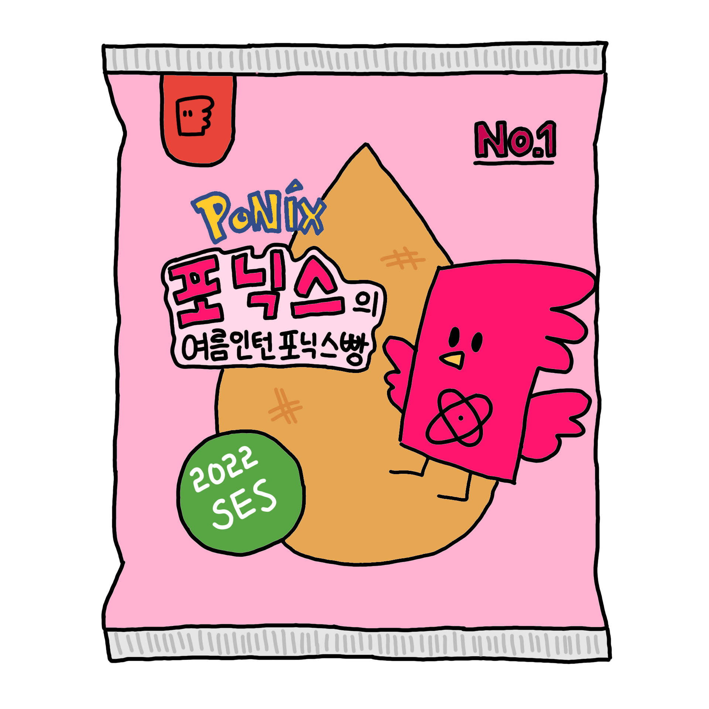

Ponix Bread
===

[](https://postech.ac.kr)



> Powered by — [react-notion-x](https://github.com/NotionX/react-notion-x) and [next.js](https://nextjs.org/) with 💙

`Ponix Bread` is event page for POSTECH SES. Get your ponix as soon as possible!

## TL;DR

```shell
docker-compose up --build --scale web=10 -d
```

## Customize

> TODO: Strings may be tiresome to customize. It will be sorted out [`string.ts`](/constants/strings.ts) one day.

It support customize via editing `PonixList` in [`ponix.ts`](constants/ponix.ts). Don't forget to add images
into [`public/ponix`](public/ponix).

## Structure

Inspired by [Wordle](https://www.nytimes.com/games/wordle/index.html), it uses `localStorage` to save users data. This
service is so tiny that it does not need a database.